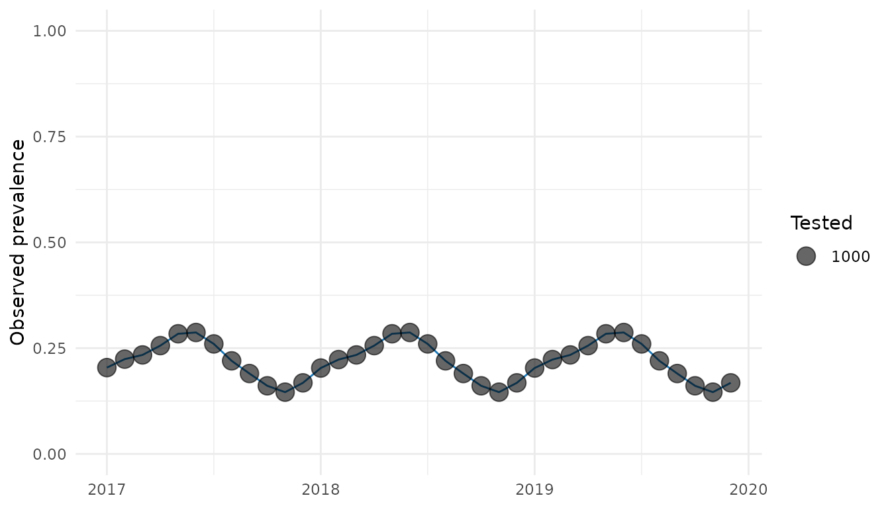

# Preparing data and configuration for anatembea

Particle Markov chain Monte Carlo (pMCMC) can be computationally
expensive. A longer run will not repair invalid counts, incorrectly
ordered dates, or a poorly specified initialization. This article
therefore prepares and freezes the analysis specification *before*
tuning begins.

At the end of this article you will have:

1.  a checked monthly prevalence dataset;
2.  a documented model specification; and
3.  enough provenance to reproduce the analysis.

The next article, [Tuning an anatembea
pMCMC](https://mrc-ide.github.io/anatembea/articles/tuning-pmcmc.md),
uses that frozen specification to select a particle count and proposal
covariance.

## Required data

For a single comparison group,
[`run_pmcmc()`](https://mrc-ide.github.io/anatembea/reference/run_pmcmc.md)
expects one row per month and at least these columns:

- `month`: a monthly time variable, represented here by
  [`zoo::yearmon`](https://rdrr.io/pkg/zoo/man/yearmon.html);
- `tested`: the number of people tested; and
- `positive`: the number who tested positive.

The package includes simulated data that we can use throughout this
series.

``` r

analysis_data <- dplyr::filter(
  dplyr::select(anatembea::sim_data_tanzania, month, positive, tested),
  month <= zoo::as.yearmon("Dec 2019")
)

head(analysis_data, 4)
#>      month positive tested
#> 1 Jan 2017      204   1000
#> 2 Feb 2017      224   1000
#> 3 Mar 2017      234   1000
#> 4 Apr 2017      256   1000
```

For paired ANC comparisons such as `comparison = "pgmg"`, prepare
separate primigravidae and multigravidae datasets with the same three
columns and pass them as `data_raw_pg` and `data_raw_mg`. See
[`run_pmcmc()`](https://mrc-ide.github.io/anatembea/reference/run_pmcmc.md)
for all supported comparison groups.

## Validate before fitting

The helper below checks structural errors while allowing a month in
which both counts are missing. `anatembea` can treat such a month as an
unobserved time point, but a missing `positive` paired with a
non-missing `tested` (or vice versa) is ambiguous and should be
resolved.

``` r

validate_monthly_prevalence <- function(data) {
  required <- c("month", "positive", "tested")
  missing_columns <- setdiff(required, names(data))
  if (length(missing_columns) > 0) {
    stop("Missing required columns: ", paste(missing_columns, collapse = ", "))
  }

  month_key <- format(data$month, "%Y-%m")
  if (anyNA(month_key)) stop("`month` contains missing or unparseable values.")
  if (is.unsorted(data$month)) stop("Rows must be in chronological order.")
  if (anyDuplicated(month_key)) stop("Each month must appear at most once.")

  one_count_missing <- xor(is.na(data$positive), is.na(data$tested))
  if (any(one_count_missing)) {
    stop("`positive` and `tested` must be missing together.")
  }

  observed <- !is.na(data$positive)
  positive <- data$positive[observed]
  tested <- data$tested[observed]

  if (any(!is.finite(c(positive, tested)))) {
    stop("Observed counts must be finite.")
  }
  if (any(positive != floor(positive) | tested != floor(tested))) {
    stop("Observed counts must be whole numbers.")
  }

  invalid_counts <- positive < 0 | tested < 0 | positive > tested
  if (any(invalid_counts)) {
    stop("Counts must satisfy 0 <= positive <= tested.")
  }

  expected <- format(
    seq(min(data$month), max(data$month), by = 1 / 12),
    "%Y-%m"
  )
  gaps <- setdiff(expected, month_key)
  if (length(gaps) > 0) {
    warning("Missing calendar months: ", paste(gaps, collapse = ", "))
  }

  invisible(data)
}

validate_monthly_prevalence(analysis_data)

invalid_example <- analysis_data[1, ]
invalid_example$positive <- Inf
try(validate_monthly_prevalence(invalid_example))
#> Error in validate_monthly_prevalence(invalid_example) : 
#>   Observed counts must be finite.

invalid_example$positive <- 1.5
try(validate_monthly_prevalence(invalid_example))
#> Error in validate_monthly_prevalence(invalid_example) : 
#>   Observed counts must be whole numbers.
```

A gap is a month with no row; a missing observation is a row with both
counts set to `NA`. Decide deliberately which representation your
analysis uses. Also plot `positive / tested` and `tested` over time.
Abrupt changes may be real, but they often reveal altered reporting
systems, duplicated extracts, or changes in the population being tested.

``` r

plot_data <- dplyr::mutate(
  analysis_data,
  prevalence = positive / tested
)

ggplot2::ggplot(plot_data, ggplot2::aes(month, prevalence)) +
  ggplot2::geom_line(colour = "#1F78B4") +
  ggplot2::geom_point(ggplot2::aes(size = tested), alpha = 0.6) +
  ggplot2::scale_y_continuous(limits = c(0, 1)) +
  ggplot2::labs(x = NULL, y = "Observed prevalence", size = "Tested") +
  ggplot2::theme_minimal()
```



## Freeze the scientific specification

Write down the settings that determine what the model means, not just
how long it runs. At minimum, record:

- `comparison` and the population represented by each input series;
- `initial`, `target_prev`, and the initial-condition window;
- `check_flexibility` and `start_pf_time`;
- treatment and seasonality assumptions, including geographic inputs;
- fitted parameter names and their order; and
- any departure from package defaults.

For example:

``` r

analysis_spec <- list(
  analysis_id = "tanzania-u5-example",
  comparison = "u5",
  initial = "fitted",
  check_flexibility = TRUE,
  start_pf_time = 30 * 12,
  prop_treated = 0.4,
  seasonality_on = TRUE,
  fitted_parameters = c("log_init_EIR", "volatility")
)

analysis_spec
#> $analysis_id
#> [1] "tanzania-u5-example"
#> 
#> $comparison
#> [1] "u5"
#> 
#> $initial
#> [1] "fitted"
#> 
#> $check_flexibility
#> [1] TRUE
#> 
#> $start_pf_time
#> [1] 360
#> 
#> $prop_treated
#> [1] 0.4
#> 
#> $seasonality_on
#> [1] TRUE
#> 
#> $fitted_parameters
#> [1] "log_init_EIR" "volatility"
```

### Choose an initialization mode

Use `initial = "fitted"` when initial transmission intensity should be
inferred from the data. In the current implementation, the fitted
parameters are ordered as `log_init_EIR` and then `volatility`.
Proposals for `log_init_EIR` are bounded between `log(1e-3)` and
`log(500)` before model evaluation.

Use `initial = "informed"` when an equilibrium EIR or target prevalence
is a scientifically defensible input. Only `volatility` is then sampled.
Because these modes have different parameter spaces, they cannot share a
proposal covariance.

## Record software, inputs, and seeds

Package behavior can change between releases. Save versions and source
revisions alongside every submitted run.

``` r

provenance <- list(
  recorded_at = format(Sys.time(), tz = "UTC"),
  R = R.version.string,
  packages = vapply(
    c("anatembea", "mcstate", "dust", "odin.dust", "odin"),
    function(x) as.character(utils::packageVersion(x)),
    character(1)
  ),
  git_commit = tryCatch(
    system2("git", c("rev-parse", "HEAD"), stdout = TRUE, stderr = FALSE),
    error = function(e) NA_character_
  ),
  seeds = c(smoke = 1101L, pilot = 2101L, scale_1 = 3101L)
)

provenance
#> $recorded_at
#> [1] "2026-08-26 08:34:33"
#> 
#> $R
#> [1] "R version 4.6.1 (2026-06-24)"
#> 
#> $packages
#> anatembea   mcstate      dust odin.dust      odin 
#>   "1.1.0"  "0.9.22"  "0.15.3"  "0.3.13"  "1.5.12" 
#> 
#> $git_commit
#> [1] "8e4f3fd7afe16cb5fda63bc7cce215a3ab0dcf7f"
#> 
#> $seeds
#>   smoke   pilot scale_1 
#>    1101    2101    3101
```

For file-based inputs, `tools::md5sum("path/to/input.csv")` provides a
compact way to detect whether the file has changed. A project-specific
library managed with [renv](https://rstudio.github.io/renv/) can record
package versions, but the resolved `anatembea` commit or release should
still be saved explicitly.

Do not install a moving branch such as `HEAD` in a production job
without recording the resolved commit.

## Gate: ready to tune?

Proceed only when all of the following are true:

- counts, dates, groups, and gaps have been reviewed;
- initialization and seasonality return finite, plausible states;
- the fitted parameter names and order are recorded;
- model assumptions are frozen; and
- inputs, software versions, and unique seeds can be reconstructed.

You are now ready to [tune the
pMCMC](https://mrc-ide.github.io/anatembea/articles/tuning-pmcmc.md).
